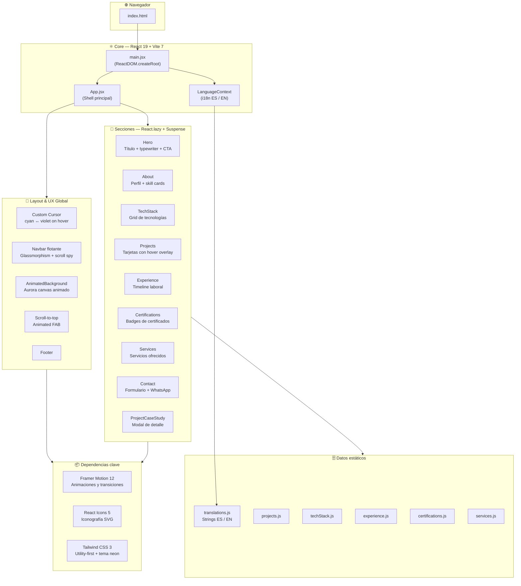

<div align="center">

# Jersson Corilla Miranda — Portfolio

**Software Engineer · Full Stack · Cloud Solutions**

[](https://react.dev)
[](https://vitejs.dev)
[](https://tailwindcss.com)
[](https://www.framer.com/motion)
[](#)

Portafolio personal construido con React 19 + Vite 7. Diseño dark neon con paleta cyan/violeta, animaciones fluidas con Framer Motion, soporte bilingüe ES/EN y carga optimizada mediante lazy loading por sección.

</div>

---

## Arquitectura del proyecto



---

## Características

| Característica | Detalle |
|---|---|
| **Bilingüe ES/EN** | Toggle en navbar via `LanguageContext` + `translations.js` |
| **Dark neon design** | Cyan `#06b6d4` + violeta `#a855f7`, glassmorphism, box-shadow neon |
| **Lazy loading** | Cada sección cargada con `React.lazy` + `Suspense` |
| **Custom cursor** | Cursor neon que cambia cyan→violeta al hover en interactivos |
| **Scroll spy** | Navbar resalta la sección activa en tiempo real |
| **Animaciones** | Framer Motion: entradas, hover, transiciones de layout |
| **Aurora background** | Fondo generativo animado en canvas |
| **CV descargable** | PDF directo desde navbar y sección Hero |
| **Responsive** | Mobile-first, breakpoints xs (475px) → 2xl |

---

## Stack tecnológico

### Frontend
- **React 19** — Concurrent features, `React.lazy`, `Suspense`
- **Vite 7** — Build ultrarrápido con HMR
- **Tailwind CSS 3** — Tema extendido: paleta neon, tipografías, keyframes personalizados
- **Framer Motion 12** — Animaciones declarativas, `AnimatePresence`, `layoutId`

### Diseño
- **Tipografías**: `Syne` (display/títulos) · `DM Sans` (cuerpo) · `JetBrains Mono` (código) · `Rajdhani` (hero)
- **Paleta**: `primary` cyan · `accent` violeta · `gold` · `dark`
- **Efectos**: glassmorphism · shimmer text · box-shadow neon · aurora canvas

### Dev tooling
- ESLint 9 · Autoprefixer · PostCSS

---

## Estructura del proyecto

```
portafolio/
├── public/
│   └── CV_jersson_corilla_miranda.pdf
├── src/
│   ├── components/
│   │   ├── AnimatedBackground.jsx   # Canvas aurora animado
│   │   ├── Hero.jsx
│   │   ├── About.jsx
│   │   ├── TechStack.jsx
│   │   ├── Projects.jsx
│   │   ├── ProjectCaseStudy.jsx     # Modal de detalle de proyecto
│   │   ├── Experience.jsx
│   │   ├── Certifications.jsx
│   │   ├── Services.jsx
│   │   ├── Contact.jsx
│   │   └── Footer.jsx
│   ├── context/
│   │   └── LanguageContext.jsx      # Proveedor i18n ES/EN
│   ├── data/
│   │   ├── translations.js          # Todos los strings del sitio
│   │   ├── projects.js
│   │   ├── techStack.js
│   │   ├── experience.js
│   │   ├── certifications.js
│   │   └── services.js
│   ├── App.jsx                      # Shell: navbar, cursor, scroll, layout
│   ├── main.jsx
│   └── index.css
├── tailwind.config.js
├── vite.config.js
└── package.json
```

---

## Inicio rápido

**Requisitos previos**: Node.js 18+

```bash
# Clonar
git clone https://github.com/jersson14/Portafolio-Jersson.git
cd Portafolio-Jersson

# Instalar dependencias
npm install

# Desarrollo (http://localhost:5173)
npm run dev

# Build de producción
npm run build

# Preview del build
npm run preview
```

---

## Despliegue

### Vercel (recomendado)

```bash
npm i -g vercel
vercel
```

### Netlify

```bash
npm run build
netlify deploy --prod --dir=dist
```

### GitHub Pages

Agrega en `package.json`:
```json
"homepage": "https://jersson14.github.io/Portafolio-Jersson",
"predeploy": "npm run build",
"deploy": "gh-pages -d dist"
```
```bash
npm install --save-dev gh-pages
npm run deploy
```

---

## Personalización rápida

**Proyectos** → `src/data/projects.js`  
**Experiencia** → `src/data/experience.js`  
**Tecnologías** → `src/data/techStack.js`  
**Certificaciones** → `src/data/certifications.js`  
**Servicios** → `src/data/services.js`  
**Textos ES/EN** → `src/data/translations.js`  
**Colores/fuentes** → `tailwind.config.js`  
**CV** → reemplazar `/public/CV_jersson_corilla_miranda.pdf`

---

## Autor

**Jersson Corilla Miranda** — Software Engineer · Full Stack · Cloud Solutions

> 5+ años de experiencia en diseño, desarrollo y despliegue de aplicaciones web empresariales.
> Especialidad en AWS/Azure, Business Intelligence y automatización con IA.

- LinkedIn: [linkedin.com/in/jersson-corilla](https://linkedin.com/in/jersson-corilla)
- GitHub: [@jersson14](https://github.com/jersson14)
- Email: jersson1407miranda@gmail.com

---

<div align="center">
Hecho con React + Vite · Diseñado en Perú
</div>
